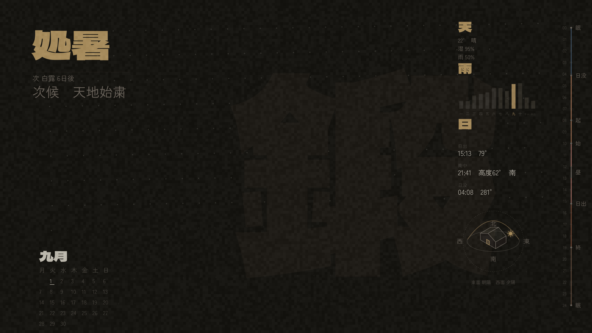
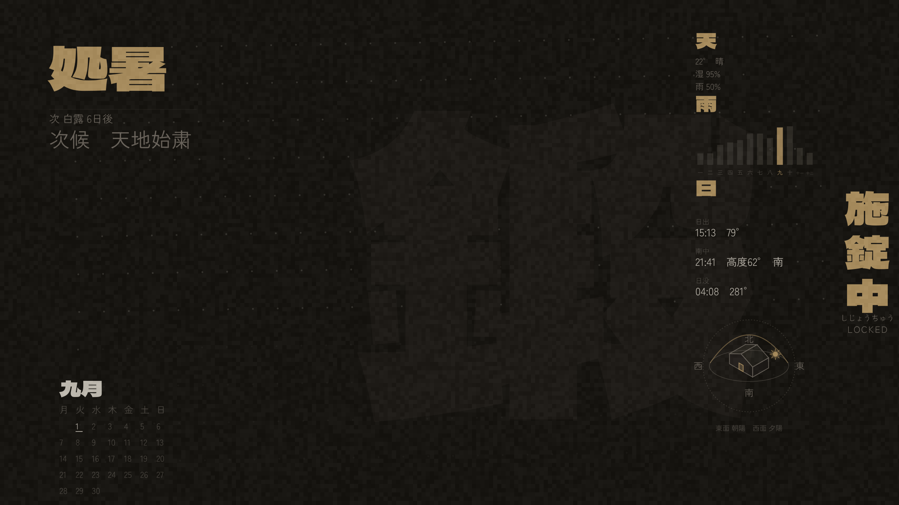

# DISCLAIMER: AI SLOP: This was completely vibe coded but works
# jikan (時間)

A generated desktop wallpaper: a sparse, low-contrast Japanese almanac —
current month, day of week, current solar term (二十四節気), current
microseason (七十二候), a giant "kanji of the day," a subtle year-progress
field, and a 24-hour day bar (sunrise/sunset/work/lunch/sleep, with a live
"now" marker). Replaces the old day-of-week-overlay wallpaper script.

Three ambient environmental modules sit in the gap between the giant kanji
and the day bar: current weather (天), a 12-month rainfall climatology (雨 —
whatever your configured location's actual annual shape is, wet/dry or
four-season), and solar geometry (日 — sunrise/solar-noon/sunset times,
azimuth, altitude, and a small house/compass diagram). An optional fourth,
off by default, is a currency module (為替 — today's USD/COP official TRM
with min/max, a trend arrow, and a GitHub-style weekly strip); it's
Colombia-specific but doubles as a clean template for any
fetch-with-cache module. See "Environmental modules" below.

## Examples

Rendered with the example `config.toml` shipped in this repo (Tokyo,
2026-09-01):

| Desktop wallpaper | i3lock background |
|---|---|
|  |  |

## Requirements

- Python 3.11+ (uses stdlib `tomllib`)
- [Inkscape](https://inkscape.org/) CLI (`inkscape`) — used to rasterize the
  generated SVG
- [feh](https://feh.finalrewind.org/) — the only wallpaper-setter backend
  implemented so far
- Fonts: Dela Gothic One, Zen Kaku Gothic New, Noto Sans JP (all free
  Google Fonts / Noto CJK), resolved via fontconfig — install these or
  adjust `[fonts]` in `config.toml` to fall back to whatever you have
- Python packages: `pip install -r requirements.txt` (numpy, Pillow)

Deliberately does *not* duplicate the i3bar (network/disk/battery/time) --
this shows slower-moving context: day, month, season, solar term,
microseason, year progress. Mostly not real-time -- the one exception is the
day bar's "now" marker, which is why this regenerates every 15 minutes
rather than once a day (see Updating).

A far-right i3bar button (解説) opens a floating terminal with readings and
meanings for everything currently on screen -- `explain.py` / `~/bin/kanji-explain`.

The same palette also drives i3's own window-border colors and the i3bar's
colors (`i3_theme.py`) -- see "i3 theming" below.

## Theming: segment-driven, not accent-driven

The whole scene's atmosphere is driven by the current **day segment** --
this isn't a single accent color layered on top of a static wallpaper, it's
a full palette swap, smoothly interpolated across the day. `palette.py`
defines 5 segments, each a complete 8-token palette (background / ghost /
tertiary / secondary / primary / accent / glow / timeline_active), authored
in OKLCH and interpolated in **OKLab** (a perceptual color space) rather
than raw sRGB -- sRGB lerp between two hues produces a muddy, uneven-looking
midpoint; OKLab lerp stays perceptually smooth throughout the transition.

| Segment | Kanji | Range | Mood |
|---|---|---|---|
| night | 深夜 | 00:00 -> sunrise | darkest, coolest, lowest contrast |
| dawn | 朝 | sunrise -> work_start | cool-clear, contrast rising |
| day | 日中 | work_start -> sunset | most neutral (lowest chroma), highest contrast/clarity |
| dusk | 夕 | sunset -> work_end | warmest, highest accent chroma |
| evening | 夜 | work_end -> 24:00 | muted-warm, contrast compressing back down |

`palette.current_palette()` does the live interpolation: stable through
most of a segment, then a rapid transition within a 1-hour window centered
on each boundary, using the same logistic/sigmoid curve as before (see the
note in `palette.py` -- a plain logarithm produces the opposite shape,
steep near zero and flattening as it grows, not "stable then rapid").
`renderer.resolve_palette()` returns this live palette when `now` actually
matches the target date, else falls back to the fixed "day" palette --
`--date`/`--output` testing stays reproducible.

**Theming hierarchy** -- not everything is themed at the same strength:

| Strength | Elements | Token used |
|---|---|---|
| Strong | background, ghost kanji, solar term, active bar segment, now-marker | `background`/`ghost`/`accent`/`timeline_active`/`glow` (full value) |
| Moderate | microseason, calendar month header + today marker, bar event labels/lunch span, year-progress elapsed dots, explain-popup headings, weather/rainfall/solar-geometry body text, current-month rainfall bar | `secondary`/`primary`, or a partial OKLab nudge (dots: ~30% toward `accent`) |
| Light | weekday row, calendar numerals, hour ticks/numbers, hairline under solar term, other-month rainfall bars, house diagram/compass labels/hint | `tertiary`, sometimes at reduced alpha |
| Barely | year-progress future dots | tiny (~12%) nudge toward `tertiary`, mostly the original neutral gray |

The 天/雨/日 module headers themselves are treated like the solar-term
heading -- a small anchor, `accent` -- with everything beneath each header
one tier down, same hierarchy logic as the rest of the composition.

Two elements found real bugs from the earlier single-accent model, both
fixed by moving to full-palette tokens instead of tinting one piece at a
time:
- Tinting *only* the background toward a warm color while leaving the
  kanji a fixed cool gray made the kanji read as strong complementary-color
  contrast (looked like "a solid blue rectangle") even though its lightness
  never changed -- fixed by giving `ghost` its own token in the same
  palette, moving in lockstep with `background`.
- The day bar's spine used to show one blended live color across the whole
  legend; now each of the 5 segments shows its own **fixed** `accent`
  (the always-visible "day wheel" legend), except the currently active
  segment, which is boosted to `timeline_active` (brighter, thicker) so
  "you are here" reads as clearly emphasized against the other 4.

Noise intensity also varies slightly per segment (`_NOISE_INTENSITY_MULTIPLIER`
in `renderer.py`: night/evening quieter, day crisper, dusk a touch stronger)
-- the texture *pattern* never changes, only its strength.

The kanji-explain popup (`explain.py`) calls the exact same
`resolve_palette()` the wallpaper uses and colors its headings via ANSI
truecolor escapes, so it visually matches whatever segment is currently
active rather than looking like an unrelated terminal. Requires `less -R`
(not plain `less`) to actually render the escape codes instead of printing
them literally -- easy to miss since `less` silently shows garbled `^[[...`
sequences with plain `-r`/no flag.

`[colors]` no longer exists in `config.toml` -- it's fully superseded by
`palette.py`'s `SEGMENT_PALETTES`. Editing per-segment colors currently
means editing that dict directly, not through TOML.

## Usage

```
python main.py                                  # generate + set today's wallpaper
python main.py --output preview.png --no-set     # render only, inspect before applying
python main.py --date 2026-09-01                 # override the date shown
python main.py --seed 2026-09-01                 # override the generative-geometry seed
python main.py --config /path/to/config.toml     # use a specific config file
```

## Configuration

Edit `config.toml`:

- `[fonts]` -- display font (giant kanji / month / solar term) and text font
  (microseason / calendar / annotations), each a fallback list resolved via
  fontconfig (`fc-match`).
- Colors are not configured here anymore -- see "Theming" below.
- `[kanji]` -- `mode = "daily"` picks deterministically from `list` by date
  (`date.toordinal() % len(list)`); `mode = "manual"` always shows `manual`.
  Edit `list` freely -- no auto-generated meanings, just characters you pick.
- `[modules]` -- toggle each element off independently. `english_translation`
  adds a small gloss under the microseason name. `weather`/`rainfall`/
  `solar_geometry` toggle the three environmental modules; `currency`
  (off by default) toggles the optional 為替 USD/COP module -- see
  `[currency]` and `currency.py`. It always renders when on, surfacing its
  state (live / stale-cached / unavailable) instead of vanishing on
  failure, and is guarded by a cache TTL so it never hammers the API.
- `[location]` -- latitude/longitude for sunrise/sunset (day bar), and for
  the weather/rainfall/solar-geometry modules.
- `[schedule]` -- day bar markers: `wake`, `work_start`, `lunch` (+
  `lunch_duration_minutes`, rendered as a span not a point), `work_end`, `sleep`.
- `[wallpaper]` -- `setter = "feh"` (only backend implemented so far).
- `[weather]` -- `provider` (only `"open-meteo"` implemented), `timeout_seconds`
  for the live fetch.
- `[rainfall]` -- `data_path` to the static climatology JSON (see below).
- `[house]` -- `rotation_deg`, degrees clockwise from true north applied to
  the solar-geometry module's house/compass diagram (0 = a plain N/E/S/W-
  aligned rectangle).

## How the astronomy works

`seasons.py` computes the Sun's apparent ecliptic longitude directly (a
standard low-precision formula, no ephemeris file, no per-year lookup table
that would go stale) and buckets it into 24 solar terms (15° each) and 72
microseasons (5° each -- each term divides into exactly 3, an exact
astronomical relationship: 72×5°=24×15°=360°). Evaluated at local noon
(this machine's system timezone, not UTC) of the target date, so results are
stable regardless of what time of day the generator actually runs.

`data/72_microseasons.json` is the one hand-authored, correctness-critical
data file -- cross-checked against the standard published Japanese list, not
generated in bulk. If you ever touch it, re-verify: 72 entries, 24 groups of
exactly 3 (by `sekki_index`), each group's `sub_index` in order 0/1/2.

`solar_times.py` computes sunrise/sunset for the day bar (same Julian-day
machinery as `seasons.py`, plus declination + equation of time, the standard
sunrise hour-angle formula). Verified against real published times for a
reference location -- consistently a few minutes off, same tolerance class as
the solar-term math; fine for a decorative wallpaper, not for navigation.

## Environmental modules: weather, rainfall, solar geometry

Three modules stacked in the gap between the giant kanji's right shoulder
and the day bar (nothing else occupied that space; the ghost kanji is
designed to be seen through anyway, same as the term block/calendar already
sitting in front of it elsewhere). Each is a plain SVG-fragment function in
`renderer.py`, gated by its own `[modules]` flag, following the same shape
as every other module (`(cfg, layout, palette, ...) -> str`).

**天 weather** (`weather.py`) -- current temperature, a short condition
word, humidity, precipitation chance. Ambient only, not a forecast, and
deliberately not duplicating the i3bar. Fetched from Open-Meteo (no API key)
with a short timeout; `get_weather()` never raises -- on any failure it
falls back to the last successful response cached at
`~/.local/state/jikan/weather_cache.json`, and if neither is available the
module is omitted entirely (not a placeholder). `explain.py`'s popup reads
that same cache file directly (`load_cached_weather`, no network call) so
it always describes exactly what the wallpaper last showed, never a
separate independent fetch.

**雨 yearly rainfall cycle** (`rainfall.py`) -- a 12-month climatology
sparkline, not a chart with axes: thin bars scaled to each month's typical
rainfall, current month bumped to `accent`. Many locations' meaningful
annual rhythm isn't the four-season model (tropical locations are often
wet/dry, for instance), so this is a deliberate addition to (not
replacement of) the Japanese solar-term content elsewhere, showing whatever
shape your configured location's climate actually has. Static data --
climate normals barely move year to year, so this is *not*
fetched at render time. `data/rainfall_climatology.json` holds pre-fetched
20-year monthly means (mm) from NASA POWER's climatology API (MERRA-2,
2001-2020) for the configured location; regenerate via
`python scripts/fetch_rainfall_climatology.py` if the location changes or
the data should be refreshed. Missing/malformed data -> module omitted,
same failure philosophy as weather.

**日 solar geometry** (`solar_times.solar_geometry`) -- sunrise/solar-noon/
sunset times, sunrise/sunset azimuth, solar-noon altitude, and whether solar
noon is north or south of zenith, plus a small house/compass diagram. This
is functionally useful, not decorative: at latitudes within the tropics
(roughly ±23.5°), solar declination crosses the observer's latitude twice a
year, so the north/south answer genuinely flips -- unlike at higher
latitudes where it's always the same. Pure local astronomy (reuses
`seasons.py`/`solar_times.py`'s
existing declination/equation-of-time machinery), no external API, so this
module can never fail the way weather can.

The house diagram (`_house_diagram_svg`) draws a footprint -- rectangle +
hip-roof ridge lines (the standard architectural site-plan symbol: a
shorter inner ridge segment with 4 lines out to the corners) + a door
notch on the front edge, all unfilled outline, matching the project's
existing thin-hairline linework rather than a filled icon. The door makes
the shape directional (a plain box+roof silhouette is mirror-symmetric, so
rotating it does nothing visually distinguishable), and it rotates as one
group via `[house] rotation_deg`, inside a fixed compass ring (北/東/南/西
never rotate -- a compass can't lie about where north actually is).
Sunrise/solar-noon/sunset are plotted by true azimuth (solar noon's azimuth
is exact: 0° or 180° depending on the north/south answer above), connected
by a dashed path. A one-line hint below names whichever of the house's
four (rotated) faces is angularly closest to sunrise vs. sunset azimuth
(e.g. "東面 朝陽　西面 夕陽") -- azimuth + house orientation only,
deliberately no facade heat-load modeling in this version; `rotation_deg`
already threads through the geometry so per-façade bearings would be a
natural later extension if ever needed.

**Convention**: at `rotation_deg=0` the door faces due south (the
rectangle's local +y edge) -- picture standing at your own front door,
facing outward, away from the house. The sunrise/sunset dots are always
astronomically fixed on screen (near the 東/西 labels; a compass ring
can't move where east actually is), but which *wall* of the (rotated)
house ends up nearest that fixed dot depends entirely on `rotation_deg` --
that's the whole point of the setting. With the default south-facing
door, the wall nearest sunrise is the one on your left as you exit (a
standard compass-bearing fact: facing south, east -- where the sun rises
-- is on your left). If your actual front door faces a different
direction, adjust `rotation_deg` accordingly; there's no way to infer this
automatically without knowing the real building.

**At night** (`sun below the horizon right now` -- the real astronomical
condition, not the artificial "night" theming segment which is bounded by
the work schedule) the house/sun-path diagram is replaced by the current
moon phase (`moon_phase.py`, `_moon_diagram_svg`) -- the sun's path isn't
very informative once it's down. Phase is a pure low-precision calculation
(days since a well-known reference new moon, mod the synodic month,
29.530588853 days -- same accuracy class as the rest of this project's
astronomy) evaluated at local noon of the target date, same date-based-not
moment-based convention as the solar terms. The lit/dark disk is drawn via
a half-circle + a clipped ellipse (the standard moon-phase-icon technique),
not an arc path with ambiguous sweep flags. Northern-hemisphere convention
(waxing lit on the right) -- a fully latitude-correct terminator orientation
(flipped for southern-hemisphere observers) is well past what a small
decorative icon needs.

Every kanji/word these three modules can show (天, 湿, weather-condition
words, 雨, 南中, 高度, 北/東/南/西, 面, 朝陽/夕陽, an "unknown condition"
fallback 不明, and the 8 moon-phase names from 新月 to 有明の月) has an
entry in `data/kanji_glossary.json`, read the same way the day-bar labels
already are -- no separate glossary mechanism.

## Rendering

SVG is built as a plain string (`renderer.py`), rasterized via the
**inkscape CLI**, not cairosvg -- cairosvg was tried first and silently
*drops* characters missing from the first font in a `font-family` fallback
list instead of trying the next one (caught this on a real 3-character
microseason name that lost its 3rd character). inkscape uses the real
Pango/fontconfig text stack and resolves fallback correctly. The cost is
~1s of subprocess latency per render, irrelevant for a once-a-day job.

Pillow is used only offline, as a font-metrics oracle, to figure out what
font-size makes a given glyph N pixels tall (SVG `font-size` alone doesn't
map predictably to visual glyph height across fonts/glyphs) -- it never
renders the final image.

Blocky/mosaic noise is applied uniformly across the whole finished image
(background and kanji alike) as a **post-process** step (`apply_blocky_noise`
in `renderer.py`), not as an SVG filter -- SVG's `feTurbulence` only produces
smooth Perlin-style clouds, there's no "blocky" turbulence type, so getting
actual visible square blocks means generating a low-resolution noise grid
in raster space and upscaling it with nearest-neighbor (no interpolation).
Pipeline: `compose()` builds the SVG -> `rasterize()` renders it to PNG via
inkscape -> `apply_blocky_noise()` perturbs that PNG's luminance directly
(not alpha-masked -- alpha-fading noise toward a foreground color this
close to the background is invisible regardless of intensity, since faded
pixels still read as background either way).

Seeded the same way as the rest of the generative geometry
(`generative.make_rng(seed_str, "blocky_noise")`) -- stable for a given day,
changes only when the date or `--seed` changes, not on every regeneration.
This matters because the wallpaper now regenerates every 15 minutes for the
day bar's live marker; unseeded noise would flicker each time.

## Determinism

Two separate mechanisms, kept apart on purpose:

- **Kanji-of-day** (`calendar_jp.pick_kanji_of_day`): `date.toordinal() %
  len(list)`. No randomness at all.
- **Supporting geometry** (`generative.py`): small jittered variations
  (year-progress rotation, a hairline's position, small anchor shifts) from
  a `random.Random` seeded per-concern via `sha256(seed|namespace)` --
  never the global `random.seed()`. `--seed` overrides the date-derived
  default independently, for testing composition variety without changing
  the displayed date.

## Updating

The wallpaper needs to regenerate every 15 minutes (not once-daily -- see
the "now" marker note above), so it needs some kind of scheduled job. A
standard crontab entry, running both the wallpaper and the i3 theme:
```
*/15 * * * * python3 /path/to/jikan/main.py --config /path/to/jikan/config.toml && python3 /path/to/jikan/i3_theme.py
```

On systemd-less distros without vanilla `cron` (e.g. runit-based systems
like Void Linux), a small cron daemon such as `scrond` running as a
supervised service works the same way -- just point it at an equivalent
crontab file (standard 5-field syntax: `min hour day month weekday
command`; some minimal cron daemons treat a 6th leading field as a shell
glob and silently break the job, worth checking against whatever daemon you
use).

An `exec_once` line in your i3 config that runs the same two commands at i3
startup is a reasonable safety net too, for "machine was off" or
same-session config edits -- it's what the cron job would have produced
anyway, just not yet.

## i3 theming (`i3_theme.py`)

The same live palette also drives i3's `client.*` window-border colors and
the i3bar's `colors {}` block -- NOT the individual i3status-rs custom block
scripts (gwStatus/kanji-date/carla-status/kanji-explain), which are
untouched.

**Mechanism.** i3's own IPC protocol has no runtime "set color" command --
confirmed directly (not just from docs) by sending `i3-msg 'client.focused
#ff0000 #ff0000 #ff0000'` against a live instance and reading its own
parser error: the full list of accepted top-level runtime commands is
`move, exec, exit, restart, reload, shmlog, debuglog, border, layout,
append_layout, workspace, focus, kill, open, fullscreen, sticky, split,
floating, mark, unmark, resize, rename, nop, scratchpad, swap,
title_format, title_window_icon, mode, bar, gaps` -- `bar` and `gaps` exist
but only for show/hide and spacing, nothing color-related. This matches an
i3 maintainer's own answer to the same question
(https://github.com/i3/i3/discussions/6166): `client.*` are config
directives, not commands; the recommended pattern is to `include` another
file, rewrite *that* file, then `reload`.

The first attempt at that pattern used `set $var #hex` in the included file
referenced from the parent -- this does NOT work reliably: `client.focused
$var ...` at the top level fails outright ("Could not parse color"), and
`background $var` inside a *nested* block like `bar { colors {...} }`
reports no error but leaves the literal unresolved string `"$varname"` in
the running config (checked via `i3-msg -t get_bar_config` after both
`reload` and a full `restart` -- i3's `-C` config-check doesn't catch
either failure, so it silently passes and then just doesn't work).

What actually works, and what's implemented: `~/.i3/theme.conf` is a fully
**self-contained** include -- literal `client.*` lines AND the entire
`bar {}` block, no cross-file variable references at all. Since nothing is
being resolved across files, there's no limitation to hit; it's handled the
same as any other literal top-level include content. Drop your own i3
config's `bar {}` and `client.focused/focused_inactive/unfocused/background`
lines entirely in favor of `include ~/.i3/theme.conf`, so unlike the
marker-rewrite attempt, this **never touches your main `~/.i3/config`** --
no drift, no `--force` needed, and it plays fine with a dotfiles manager if
your main config is one of the managed files. If you run i3 on multiple
machines and only want this on some of them, just make the `include` line
conditional in whatever way your own config templating already supports.
Verified against a live instance: exactly one bar (`i3-msg -t
get_bar_config` returns a single `bar-0`, not zero or two), with real
resolved hex values, stable across both `reload` and a full `restart`.

`client.urgent` and `bar.urgent_workspace` are deliberately left OUT of
`theme.conf` and stay at their original static, vivid red/pink values in
`config.tmpl` itself -- an urgent window or workspace needs to stay an
unambiguous "pay attention" signal regardless of the current mood palette,
not blend into a muted theme (same reasoning as the wallpaper's day-bar
"眠"/"日出" markers never trying to look urgent).

Mapping (see `i3_theme.py`'s `build_theme_conf`):

| i3 element | Token |
|---|---|
| `client.focused` (border/bg/text/indicator/child_border) | `accent`/`background`/`primary`/`accent`/`accent` |
| `client.focused_inactive` | `secondary`/`background`/`secondary`/`tertiary` |
| `client.unfocused` | `tertiary`/`background`/`tertiary`/`tertiary` |
| `client.background` | `background` |
| bar `background` / `statusline` | `background` / `primary` |
| bar `focused_workspace` | `accent`/`accent`/`background` |
| bar `active_workspace` | `secondary`/`secondary`/`primary` |
| bar `inactive_workspace` | `background`/`background`/`tertiary` |

## Work/life cycle indicator (`segment_indicator.py`)

A compact i3bar block next to the clock showing the current day segment as
a single glyph (深夜/朝/日中/夕/夜), colored with the live theme accent --
the same concept as the wallpaper's 24h day bar, condensed to one character.
Unlike the bar's spine legend (5 fixed colors, always all visible), this
shows only the *current* segment, so both its label and its color are live
(`renderer.resolve_palette()`, same function as everywhere else) -- glyph
changes only at a segment boundary, but the color continues the same
smooth OKLab transition described above.

`~/bin/day-segment` -> `python3 jikan/segment_indicator.py`, wired into
`status_config.toml.tmpl` as a `custom` block positioned right before the
`time` block. One gotcha hit while adding this: **`i3-msg reload` does not
restart the i3bar's `status_command` subprocess** (i3status-rs here) --
reload only reparses i3's own config (keybindings, colors, workspace defs)
and pushes updated bar *colors* to the already-running i3bar, but a
brand-new *block* in `status_config.toml` needs the i3status-rs process
itself relaunched, which only happens on a full `i3-msg restart`. A block
that silently renders blank (not an error, just empty `full_text`) after
adding it and only `reload`-ing is the symptom to watch for.

## i3lock background

A small `~/bin/lock` script (or keybinding) that locks the screen with
`i3lock -i ~/.local/state/jikan-lock.png` -- a **variation** of the
desktop wallpaper, not a separate design: every module (giant kanji, solar
term, calendar, weather/rainfall/solar-geometry) is identical, except the
24-hour day bar (not meaningful while the screen is locked) is replaced by
a vertical, top-to-bottom (縦書き, tategaki-style) kanji column reading
施錠中 (shijouchuu, "locked" -- real door-sign vocabulary, not an invented
compound), plus its reading and the literal word "LOCKED" underneath. See
`renderer._lock_indicator_svg` and `compose()`'s `lock_mode` flag, which
swaps that one module and leaves everything else in the composition alone.

`main.py` generates *both* PNGs in the same run (reusing the same
`weather`/`climatology`/`now` already computed for the desktop wallpaper --
no second weather fetch), rather than generating the lock image on demand
when `~/bin/lock` runs. Rendering takes a few seconds (inkscape subprocess,
potentially a live weather fetch); doing that inside the lock keybinding
would leave the screen visibly unlocked for those seconds, which is a real
(if minor) security/UX regression. Piggybacking on the existing 15-minute
regeneration cycle means `~/bin/lock` is just an instant `i3lock -i` against
an already-current file -- the same staleness tolerance the day bar's own
"now" marker already has. Use `--no-lock` (mirrors `--no-set`) to skip
regenerating it, or `--lock-output` to render it elsewhere for testing.

## Project layout

```
jikan/
  main.py            CLI
  config.py           tomllib -> dataclasses
  calendar_jp.py       weekday/month kanji notation, month grid, kanji-of-day
  seasons.py           solar longitude math, 24 sekki table, 72 kō lookup
  solar_times.py       sunrise/sunset for the day bar + solar_geometry() for the 日 module
  weather.py           Open-Meteo fetch + disk cache for the 天 module
  rainfall.py          static climatology loader for the 雨 module
  moon_phase.py        night-time moon phase for the 日 module's diagram swap
  explain.py           prints readings/meanings for everything on screen
  segment_indicator.py compact i3bar work/life cycle glyph next to the clock
  generative.py        seeded per-concern RNG for supporting geometry
  palette.py           OKLab color math, 5 per-segment palettes, live interpolation
  renderer.py          SVG builder + inkscape rasterizer + noise filters
  i3_theme.py          feeds the palette into i3's client.*/bar colors
  wallpaper.py         feh invocation
  scripts/fetch_rainfall_climatology.py   one-off NASA POWER fetch, not run per-render
  data/72_microseasons.json
  data/kanji_glossary.json
  data/rainfall_climatology.json
  config.toml
```

Related files outside this directory, in your own dotfiles: a
`kanji-explain` script (the review button's click target), a `day-segment`
script (the work/life cycle indicator's command), and your i3
`status_config`/`config` (the far-right bar block, the day-segment block,
a floating-window rule for the explain popup, and the `include
~/.i3/theme.conf` line).

## License

MIT -- see [LICENSE](LICENSE).
